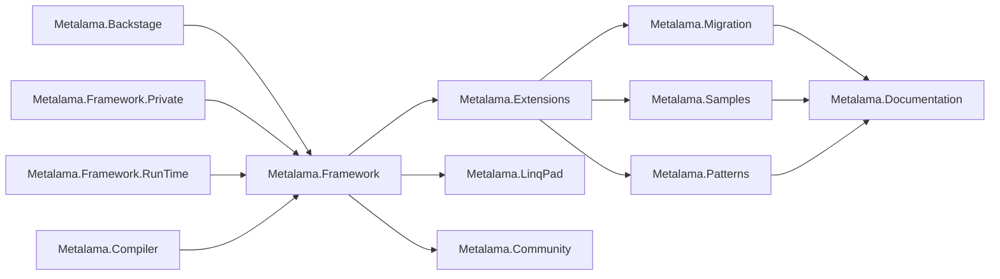

<!-- Matomo Image Tracker-->

<!-- End Matomo -->

<p align="center">

</p>

[](https://www.postsharp.net/slack)

Welcome to Metalama, a Roslyn-based meta-programming framework designed to enhance your code quality and productivity in C#. Metalama stands on three foundational principles:

* *Boilerplate Reduction*: Harness the power of aspect-oriented programming to dynamically generate repetitive code during compilation. This ensures your source code stays concise and clear.
* *Architecture as Code*: Receive real-time validation of your code against your architectural guidelines, patterns, and conventions. Say goodbye to waiting for code reviews.
* *Tailored Coding Assistance*: Arm your team with personalized code fixes and refactorings.


## Quick Links

- 🌐 [Metalama Website](https://www.postsharp.net/metalama)
- 📖 [Documentation](https://doc.metalama.net/)
- 📝 [Annotated Examples](https://doc.metalama.net/examples)
- 🎥 [Tutorial Videos](https://doc.metalama.net/videos)
- 🐞 [Bug Reports](https://github.com/postsharp/Metalama/issues)
- 💬 [Discussions](https://github.com/postsharp/Metalama/discussions)
- 📜 [Detailed Changelog](https://github.com/orgs/postsharp/discussions/categories/changelog)
- 📢 [Release Notes](https://doc.metalama.net/conceptual/aspects/release-notes)


## Repositories

This repository serves as a hub for Metalama. The codebase is distributed across the following repositories:

| Link                                                                           | License          | Description                                                                                                                                     |
| ------------------------------------------------------------------------------ | ---------------- | ----------------------------------------------------------------------------------------------------------------------------------------------- |
| [Metalama.Compiler](https://github.com/postsharp/Metalama.Compiler)           | MIT              | A [Roslyn](https://github.com/dotnet/roslyn) fork that introduces an extension point for arbitrary source code transformations. |
| [Metalama.Framework](https://github.com/postsharp/Metalama.Framework)         | Source Available | The core implementation of the Metalama Framework.                                                                                               |
| [Metalama.Framework.Private](https://github.com/postsharp/Metalama.Framework.Private)         | Proprietary | Access to this repository is required to build `Metalama.Framework` and is granted to customers who have an active Source Code Subscription.  |
| [Metalama.Backstage](https://github.com/postsharp/Metalama.Backstage)        | Source Available | Implements infrastructure core for other Metalama projects, like management of configuration and temporary files.
| [PostSharp.Engineering](https://github.com/postsharp/PostSharp.Engineering)    | MIT              | A custom multi-repo build and CI framework.                                                                                                       |
| [Metalama.Framework.RunTime](https://github.com/postsharp/Metalama.Framework.RunTime) | MIT  | Run-time classes utilized by code generated via `Metalama.Framework`.                                                                            |
| [Metalama.Extensions](https://github.com/postsharp/Metalama.Extensions)        | MIT              | Open-source, professional-grade extensions for Metalama such as dependency injection or architecture verification.                                                                                        |
| [Metalama.Patterns](https://github.com/postsharp/Metalama.Patterns)            | MIT              | Ready-to-use, open-source and professional-grade aspects, including caching, code contracts, and `INotifyPropertyChanged`.                                          |
| [Metalama.LinqPad](https://github.com/postsharp/Metalama.LinqPad)              | MIT              | A LinqPad driver for querying any C# project or solution.                                                                                        |
| [Metalama.Community](https://github.com/postsharp/Metalama.Community)          | MIT              | Repository housing community-contributed aspects.                                                                                                |
| [Metalama.Migration](https://github.com/postsharp/Metalama.Migration)          | MIT              | The original PostSharp API annotated with guidelines to transition to Metalama.                                                        |
| [Metalama.Documentation](https://github.com/postsharp/Metalama.Documentation)  | MIT              | Source repository for documentation hosted on [Metalama Docs](https://doc.metalama.net/).                                                       |
| [Metalama.Samples](https://github.com/postsharp/Metalama.Samples)              | MIT              | A collection of illustrative samples available at [Metalama Examples](https://doc.metalama.net/examples).                                        |


## Dependencies

Here is a graph of the dependencies between these repos:



## Our Git flow

* We don't use the `master` nor the `main` branch.
* We are generally concurrently working on three versions, numbered `YYYY.N`. Typically, one is stable and maintained, the other is `rc` and the third is `preview`.
* You should generally check out the `release/YYYY.N` branch.
* Our continuous integration branches are `develop/YYYY.N`. They generally depend on unpublished build artifacts of dependencies and therefore _cannot_ be easily built by the public except by building the dependencies locally. Our `develop/YYYY.N` builds can occasionally be broken.
* When we publish artifacts (for instance to `nuget.org`):
  - We update the version of package references to the ones just uploaded to `nuget.org`.
  - We mark the released commit with the precise package version, e.g. `/release/2023.4.1-preview`.
  - We merge the `develop/YYYY.N` branch into `release/YYYY.N`.
* We work on branches named `topic/YYYY.N/whatever` and generally do PRs to `develop/YYYY.N`.
* After any merge to an "old" `develop/YYYY.N`, the "old" `develop/YYYY.N` is automatically merged into the newer `develop/YYYY.N+1`. A merge commit, named `merge/YYYY.N+1/commit-123456` is automatically created, tested, if possible merged, then deleted.
* We use a private TeamCity service for our continuous integration.

### Illustration

The following schema illustrates our workflow. It shows two public builds, `2023.4.1-preview` and `2023.4.2-preview`, each including two bug fixes.

```mermaid
%%{init: { 'gitGraph': { 'mainBranchName':'develop/2023.4', 'mainBranchOrder': 1 }} }%%

gitGraph:
    commit
    branch release/2023.4 order:0
    branch topic/2023.4/1234-bug-1 order:1
    checkout topic/2023.4/1234-bug-1
    commit
    commit
    checkout develop/2023.4
    merge topic/2023.4/1234-bug-1
    branch topic/2023.4/1235-bug-2  order:2
    checkout topic/2023.4/1235-bug-2
    commit
    checkout develop/2023.4
    merge topic/2023.4/1235-bug-2 tag:"release/2023.4.1-preview" type:HIGHLIGHT
    checkout release/2023.4
    merge develop/2023.4
    branch topic/2023.4/1236-bug-3 order:3
    checkout topic/2023.4/1236-bug-3
    commit
    commit
    checkout develop/2023.4
    merge topic/2023.4/1236-bug-3
    branch topic/2023.4/1237-bug-4 order:4
    checkout topic/2023.4/1237-bug-4
    commit
    checkout develop/2023.4
    merge topic/2023.4/1237-bug-4 tag:"release/2023.4.2-preview" type:HIGHLIGHT
    checkout release/2023.4
    merge develop/2023.4
    
commit
```

## The Dream Weavers of Metalama

It's in the vibrant streets of Prague, Czechia, that an insurrection against boilerplate rose in 2004. Back in the days when the C# compiler was an obscure, closed-source monolith, inaccessible for extensibility, PostSharp became the first successful implementation of aspect-oriented in .NET. Fifteen years later, when Microsoft released .NET 5 and added source generators to Roslyn, we knew it was time for a complete rewrite based on new .NET stack. This project, originally codenamed "Caravela", became Metalama, and its first stable version was released in May 2023. 

### The Core Team

- **[Gael Fraiteur](https://github.com/gfraiteur)**: The Captain of our ship, Lead Architect, and beloved Chief Mad Scientist.
- **[Antonin Prochazka](https://github.com/prochan2)**: Senior Software Developer, DevOps Maestro, and the guy who often talks to machines (and they listen).
- **[Daniel Balas](https://github.com/addabis)**: Senior Software Developer and our in-house "Thread Whisperer". Rumor has it he can split threads finer than hair!
- **[Petr Onderka](https://github.com/svick)**: Senior Software Developer and Compiler Maniac, often found in deep conversations with compilers late into the night.
- **[Zuzana Hybsova](https://github.com/Zu-Hy)**: Our anchor, the Back-Office Manager. The only one who ensures our creative chaos remains just the right side of insane.

### The Passionate Collaborators

- **[Alex Dolin](https://github.com/aleksd)**: Dived head-first into Metalama's proof-of-concept phase in 2020 when the project was still named Caravela.
- **[Tom Glastonbury](https://github.com/tg73)**: The passionate soul behind the inception of `Metalama.Patterns` in 2023. Some say he dreams in patterns.

### Our Enthusiast VIPs

We extend our deepest gratitude to the following champions for their countless suggestions, invaluable feedback, and diligent bug reports that have immensely contributed to our community:

- [Whit Waldo](https://github.com/WhitWaldo)
- [Dom Sinclair](https://github.com/domsinclair)
- [Onur Er](https://github.com/XtroTheArctic)
- [Marc Kruse](https://github.com/mkruse)

Their dedication and insights have been pivotal in shaping Metalama to its finest.