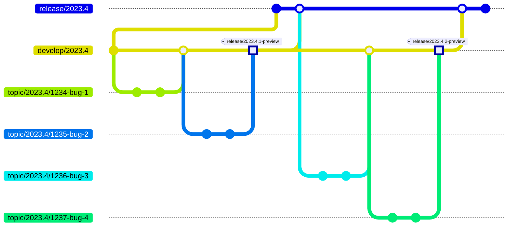

Welcome to Metalama, a Roslyn-based framework for code generation and validation, designed to enhance your code quality and productivity in C#. Metalama stands on three foundational principles:

* *Boilerplate Reduction*: Harness the power of aspect-oriented programming to dynamically generate repetitive code during compilation. This ensures your source code stays concise and clear.
* *Architecture as Code*: Receive real-time validation of your code against your architectural guidelines, patterns, and conventions. Say goodbye to waiting for code reviews.
* *Tailored Coding Assistance*: Arm your team with personalized code fixes and refactorings.

## Quick Links

- 🌐 [Metalama Website](https://www.postsharp.net/metalama)
- 📖 [Documentation](https://doc.postsharp.net/metalama)
- 📝 [Annotated Examples](https://doc.postsharp.net/metalama/examples)
- 🎥 [Tutorial Videos](https://doc.postsharp.net/metalama/videos)
- 🐞 [Bug Reports](https://github.com/postsharp/Metalama/issues)
- 💬 [Discussions](https://github.com/postsharp/Metalama/discussions)
- 📜 [Detailed Changelog](https://github.com/orgs/postsharp/discussions/categories/changelog)
- 📢 [Release Notes](https://doc.postsharp.net/metalama/conceptual/aspects/release-notes)
- ✨ [Visual Studio Extension](https://marketplace.visualstudio.com/items?itemName=PostSharpTechnologies.PostSharp)

## Repositories

This repository serves as a hub for Metalama. The codebase is distributed across the following repositories:

| Link                                                                           | License          | Description                                                                                                                                     |
| ------------------------------------------------------------------------------ | ---------------- | ----------------------------------------------------------------------------------------------------------------------------------------------- |
| [Metalama.Compiler](https://github.com/postsharp/Metalama.Compiler)           | MIT              | A [Roslyn](https://github.com/dotnet/roslyn) fork that introduces an extension point for arbitrary source code transformations. |
| [Metalama.Framework](https://github.com/postsharp/Metalama.Framework)         | Source Available | The core implementation of the Metalama Framework.                                                                                               |
| [Metalama.Framework.Private](https://github.com/postsharp/Metalama.Framework.Private)         | Proprietary | Access to this repository is required to build `Metalama.Framework` and is granted to customers who have an active Source Code Subscription.  |
| [Metalama.Backstage](https://github.com/postsharp/Metalama.Backstage)        | Source Available | Implements infrastructure core for other Metalama projects, like management of configuration and temporary files.
| [PostSharp.Engineering](https://github.com/postsharp/PostSharp.Engineering)    | MIT              | A custom multi-repo build and CI framework.                                                                                                       |
| [Metalama.Framework.RunTime](https://github.com/postsharp/Metalama.Framework.RunTime) | MIT  | Run-time classes utilized by code generated via `Metalama.Framework`.                                                                            |
| [Metalama.Extensions](https://github.com/postsharp/Metalama.Extensions)        | MIT              | Open-source, professional-grade extensions for Metalama such as dependency injection or architecture verification.                                                                                        |
| [Metalama.Patterns](https://github.com/postsharp/Metalama.Patterns)            | MIT              | Ready-to-use, open-source and professional-grade aspects, including caching, code contracts, and `INotifyPropertyChanged`.                                          |
| [Metalama.LinqPad](https://github.com/postsharp/Metalama.LinqPad)              | MIT              | A LinqPad driver for querying any C# project or solution.                                                                                        |
| [Metalama.Community](https://github.com/postsharp/Metalama.Community)          | MIT              | Repository housing community-contributed aspects.                                                                                                |
| [Metalama.Migration](https://github.com/postsharp/Metalama.Migration)          | MIT              | The original PostSharp API annotated with guidelines to transition to Metalama.                                                        |
| [Metalama.Documentation](https://github.com/postsharp/Metalama.Documentation)  | MIT              | Source repository for documentation hosted on [Metalama Docs](https://doc.postsharp.net/metalama).                                                       |
| [Metalama.Samples](https://github.com/postsharp/Metalama.Samples)              | MIT              | A collection of illustrative samples available at [Metalama Examples](https://doc.postsharp.net/metalamaexamples).                                        |

## Dependencies

Here is a graph of the dependencies between these repos:

## Our Git flow

* We don't use the `master` nor the `main` branch.
* We are generally concurrently working on three versions, numbered `YYYY.N`. Typically, one is stable and maintained, the other is `rc` and the third is `preview`.
* You should generally check out the `release/YYYY.N` branch.
* Our continuous integration branches are `develop/YYYY.N`. They generally depend on unpublished build artifacts of dependencies and therefore _cannot_ be easily built by the public except by building the dependencies locally. Our `develop/YYYY.N` builds can occasionally be broken.
* When we publish artifacts (for instance to `nuget.org`):
  - We update the version of package references to the ones just uploaded to `nuget.org`.
  - We mark the released commit with the precise package version, e.g. `/release/2023.4.1-preview`.
  - We merge the `develop/YYYY.N` branch into `release/YYYY.N`.
* We work on branches named `topic/YYYY.N/whatever` and generally do PRs to `develop/YYYY.N`.
* After any merge to an "old" `develop/YYYY.N`, the "old" `develop/YYYY.N` is automatically merged into the newer `develop/YYYY.N+1`. A merge commit, named `merge/YYYY.N+1/commit-123456` is automatically created, tested, if possible merged, then deleted.
* We use a private TeamCity service for our continuous integration.

### Illustration

The following schema illustrates our workflow. It shows two public builds, `2023.4.1-preview` and `2023.4.2-preview`, each including two bug fixes.

[//]: # (The "commit" before the first "merge develop/2023.4" is a workaround for https://github.com/mermaid-js/mermaid/issues/5898 and should be removed when fixed.)

