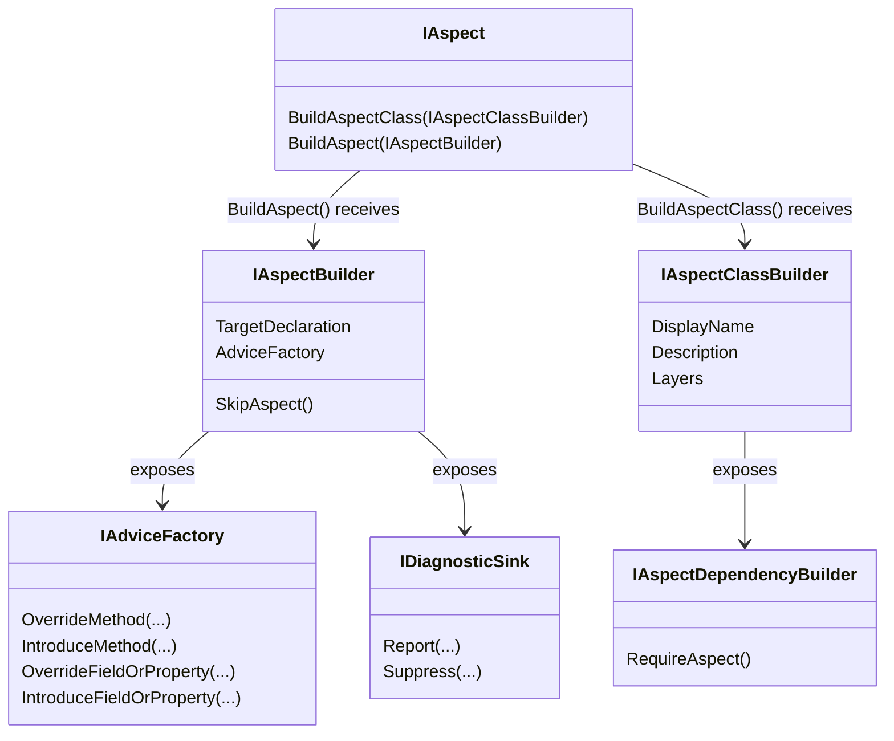

# Design of Caravela Aspect Framework

## Conceptual Class Diagram

An aspect is, by definition, a class that implements the <xref:Caravela.Framework.Aspects.IAspect%601> generic interface. The generic parameter of this interface is the type of declarations to which that aspect can be applied. For instance, an aspect that can be applied to a method must implement the `IAspect<IMethod>` interface and an aspect that can be applied to a named type must implement `IAspect<INamedType>`.

## Abilities of aspects

### Reporting and suppressing diagnostics

Aspects can report diagnostics (a single word for errors, warnings and information messages), and can suppress diagnostics reported by the C# compiler, analyzers, or other aspects.

For details about this feature, see <xref:diagnostics>.

### Transforming the target code

Aspects can transform the target code by providing one or many _advices_. Advices are primitive transformations of code. Advices are safely composable: several aspects that do not know about each other can add advices to the same declaration.

There are two kinds of advices: _declarative_ and _imperative_.

#### Declarative advices

The only _declarative advice_ is the _member introduction_ advice and is marked by the <xref:Caravela.Framework.Aspects.IntroduceAttribute> custom attribute. For each member of the aspect class annotated with `[Introduce]`, the aspect framework will attempt to introduce the member in the target class. For details, see <xref:introducing-members>.

#### Imperative advices

_Imperative advices_ are added by the implementation of the <xref:Caravela.Framework.Aspects.IAspect%601.BuildAspect(Caravela.Framework.Aspects.IAspectBuilder{%600})> method thanks to the methods exposed by the <xref:Caravela.Framework.Aspects.IAspectLayerBuilder.AdviceFactory> property of the `builder` parameter. See <xref:Caravela.Framework.Aspects.IAdviceFactory> for a complete list of methods. In short:

- `OverrideMethod`, `OverrideFieldOrProperty`, `OverrideFieldOrPropertyAccessors`, `OverrideEvent`, `OverrideEventAccessors` allow you to replace the implementation of a type member. See <xref:overriding-members> for details.
- `IntroduceMethod`, `IntroduceProperty`, `IntroduceField` and `IntroduceEvent` allows your aspect to introduce new members into the target type. See <xref:introducing-members> for details.
- `ImplementInterface` makes the target type implement an interface. See <xref:implementing-interfaces> for details.

#### Template methods

With most advices, you have to provide a _template_ of the member that you want to add to the target type (whether a new member or a new implementation of an existing one).

Templates are made of standard C# code but mix two kinds of code: _compile-time_ and _run-time_. When an advice is added to some target code, the compile-time part of the corresponding template is _executed_ and what results is the run-time code, which is then added to the source code.

For details, see <xref:templates>.

### Disabling itself

If an aspect instance decides that it cannot be applied to the target it has been applied to, its implementation of the <xref:Caravela.Framework.Aspects.IAspect%601.BuildAspect(Caravela.Framework.Aspects.IAspectBuilder{%600})> method can call the <xref:Caravela.Framework.Aspects.IAspectBuilder.SkipAspect> method. The effect of this method is to prevent the aspect to provide any advice or child aspect and to set the <xref:Caravela.Framework.Aspects.IAspectInstance.IsSkipped> to `false`.

The aspect may or may not report a diagnostic before calling <xref:Caravela.Framework.Aspects.IAspectBuilder.SkipAspect>. Calling this method does not report any diagnostic.

### Specifying on which declarations the aspect can be applied

This feature is not yet implemented.

### Validating the final code

This feature is not yet implemented.

### Adding child aspects

This feature is not yet implemented.

### Requiring other aspects

This feature is not yet implemented.

### Defining the name and description of the aspect class in the IDE

To define the appearance of the aspect in the IDE, implement the <xref:Caravela.Framework.Aspects.IAspect.BuildAspectClass(Caravela.Framework.Aspects.IAspectClassBuilder)> method and set the <xref:Caravela.Framework.Aspects.IAspectClassBuilder.DisplayName> and <xref:Caravela.Framework.Aspects.IAspectClassBuilder.Description> properties of the <xref:Caravela.Framework.Aspects.IAspectClassBuilder>.

> [!WARNING]
> Do not reference instance class members in your implementation of  <xref:Caravela.Framework.Aspects.IAspect.BuildAspectClass(Caravela.Framework.Aspects.IAspectClassBuilder)>. Indeed, this method is called on an instance obtained using `FormatterServices.GetUninitializedObject` -- that is, _without_ invoking the class constructor.

### Using several layers of advices

This feature is not yet implemented.

## Examples

### Example: the OverrideMethodAspect class

Now that you know more about the design of the aspect framework, you can look at the implementation of the <xref:Caravela.Framework.Aspects.OverrideMethodAspect> abstract class. You can see that all this class is doing is to provide define an abstract method `OverrideMethod` and to add an advice to the target method where the template is the `OverrideMethod`.

[!include[Main](../../code/Caravela.Documentation.SampleCode.AspectFramework/OverrideMethodAspect.cs#aspect)]

### Example: an aspect targeting methods, fields and properties

The following example shows a aspect that target methods, fields and properties with a single implementation class.

[!include[Aspect Targeting Methods, Fields and Properties](../../code/Caravela.Documentation.SampleCode.AspectFramework/LogMethodAndProperty.cs)]

## Code model versioning

Each aspect, and even each aspect layer, potentially sees a different version of the <xref:Caravela.Framework.Code> code model. Therefore, if an aspect introduces a member into a type, the next aspects will see that new member in the code model, and will be able to advise it.

Every declaration in the compilation is assigned a _depth_. Within the same aspect layer, declarations are processed by increasing order of depth, i.e. base classes are visited before derived classes, and types before their members, and so on.

An aspect, within one depth level, will see the modifications performed by the same aspect on declarations of lower depths.

Aspects cannot modify declarations of lower depth than the target of the aspect.

## The Caravela Pipeline

### 1. Initialization

1. Generation of the compile-time compilation:
    1. Referenced compile-time projects are identified and loaded.
    2. Compile-time code is identified in the current and a separate compile-time compilation is created.
        1. Templates are transformed into code generating Roslyn syntax trees.
        2. Expressions `nameof` and `typeof` are transformed to make them independent from run-time references.

2. Initialization of aspect classes.
    1. A prototype instance of each aspect class is created using `FormatterServices.GetUninitializedObject`.
    2. All  <xref:Caravela.Framework.Aspects.IAspect.BuildAspectClass(Caravela.Framework.Aspects.IAspectClassBuilder)>  methods are executed. Aspect layers are discovered.
    3. Aspect ordering relationships are discovered in the current project and all referenced assemblies.
    4. Aspects layers are ordered.

### 2. Applying aspects

For each aspect layer, by order of application (i.e., inverse order of execution):

- For the default aspect layer:
  - Aspect sources are evaluated for this aspect type.
  - By visiting depth:
    - Aspects are instantiated.
    - <xref:Caravela.Framework.Aspects.IAspect%601.BuildAspect(Caravela.Framework.Aspects.IAspectBuilder{%600})> is invoked.
    - Advices are added to the next steps of the pipeline.

- For all layers:
  - Advices are executed. Advices can provide observable or non-observable transformations (or both):
    - _observable transformations_ are those that affect declarations, i.e. they are visible from the code model or from the source code (for instance: introducing a method)
    - _non-observable transformations_ are those that only affect the implementation of declarations (for instance: overriding a method)

- Before we execute the next aspect layer or the next visiting depth, a new code model is created incrementally from the previous code model, plus any observable transformation added by an advice before.

### 3. Transforming the compilation

Before this step, the algorithm collected transformations, but the compilation was never modified.

What happens next depends on whether the pipeline runs at design time or compile time.

#### Compile time

1. All transformations (observable and non-observable) are introduced into a new compilation. Templates are expanded at this moment.
2. The code is linked together and inlined where possible.

#### Design time

At design time, non-observable transformations are ignored, and partial files are created for observable transformations.
Templates are never executed at design time.
