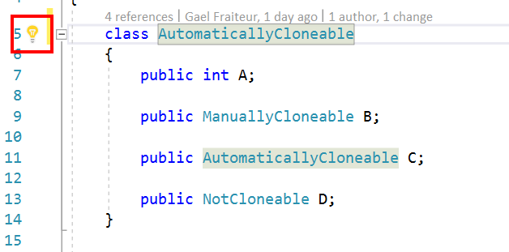
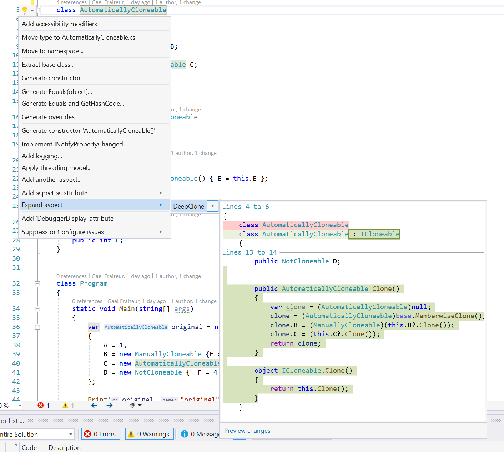

# Using Live Templates

> [!NOTE]
> This scenario is in early preview. 
> It requires __Visual Studio 2019__ and does not seem to work in other IDEs.

To apply an aspect to your source code at design time:

1. Add the aspect library to your project using a `<ProjectReference>` or a `<PackageReference>`. This step is required to have the aspect registered under the refactoring menu. You can remove the reference after the operation if needed.
   
   > [!NOTE]
   > If you only use live templates from this project, consider using the `PrivateAssets="all"` option, so the reference does not flow to the consumers of your project.

2. Position the caret on the name of the declaration to which you want to apply the aspect. 
3. Click on the lightbulb or refactoring icon, and choose Apply live template_.
    > TODO: Redo screenshots.

    

4. Select the aspect that you want to apply
    

