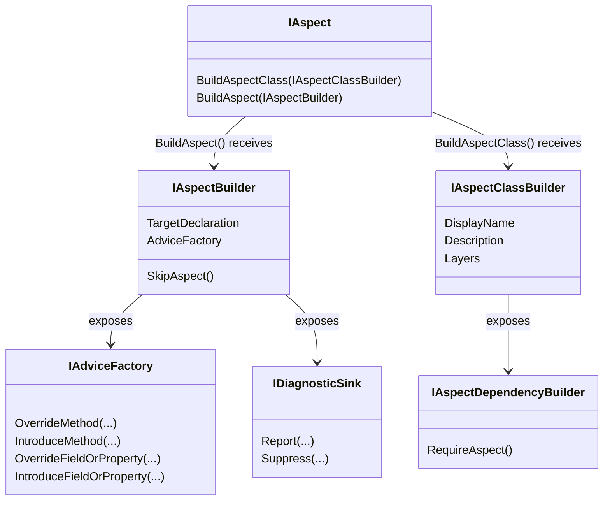
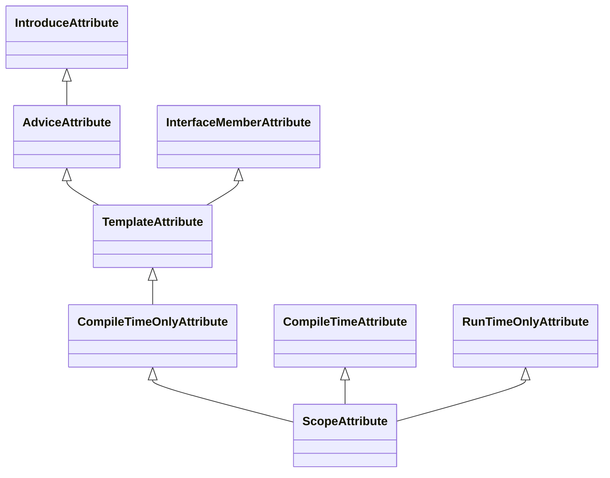

This is namespace allows you to build aspects. Aspects are an algorithmic representation of a code transformation or validation.

For instance, adding logging to a method, or implementing `INotifyPropertyChanged`, can to a great extent be expressed as
an algorithm and therefore implemented as an aspect.

To create an aspect, create a class that derives from @"System.Attribute" and implement the 
@"Caravela.Framework.Aspects.IAspect`1" interface.

For more information, see <xref:aspects>.

### Class Diagrams

#### Aspect builders

#### Scope custom attributes

