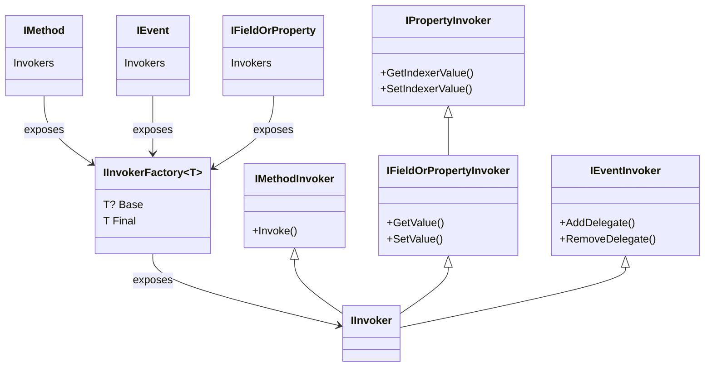

This namespace defines invokers, which are objects that generates syntax that invokes methods or accesses properties, fields or events.

Where it makes sense, declarations expose an invoker factory (@"Caravela.Framework.Code.Invokers.IInvokerFactory`1") on their `Invokers` property. 
The invoker factory interface has two properties:

-  @"Caravela.Framework.Code.Invokers.IInvokerFactory`1.Final" is equivalent to the `this` keyword in C#. It allows you to access the last override
   of the semantic.

-  @"Caravela.Framework.Code.Invokers.IInvokerFactory`1.Base" is equivalent to the `base` keyword in C#. It allows you to access the implementation
   prior to the current aspect layer.

## Class Diagram

