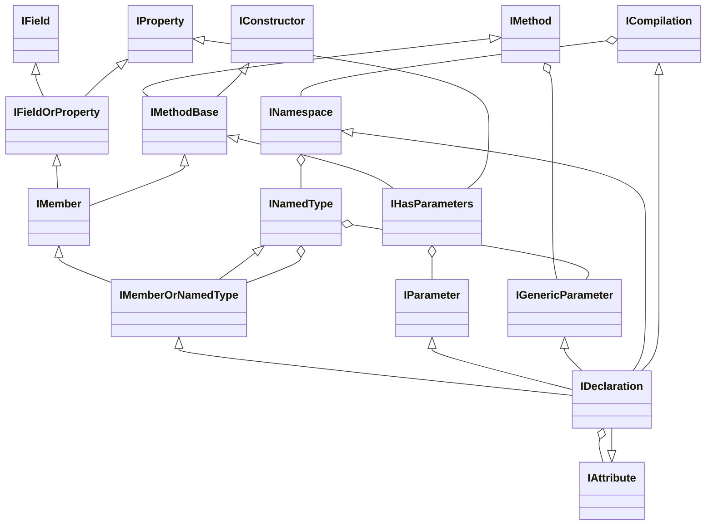

This namespace contains the representation of the source code or the transformed code.

## Simplified class diagram

```mermaid
classDiagram
      IMemberOrNamedType <|-- IDeclaration
      IMember <|-- IMemberOrNamedType
      INamedType <|-- IMemberOrNamedType
      IFieldOrProperty <|-- IMember
      IField <|-- IFieldOrProperty
      IProperty <|-- IFieldOrProperty
      IMethodBase <|-- IMember
      IMethod <|-- IMethodBase
      IConstructor <|-- IMethodBase
      IParameter <|-- IDeclaration
      IGenericParameter <|-- IDeclaration
      IAttribute <|-- IDeclaration
      INamespace <|-- IDeclaration
      ICompilation <|-- IDeclaration
      IMethodBase <|-- IHasParameters
      IProperty <|-- IHasParameters
    

      IHasParameters o-- IParameter
      IDeclaration o-- IAttribute
      IMethod o-- IGenericParameter
      INamedType o-- IGenericParameter
      INamedType o-- IMemberOrNamedType
      ICompilation o-- INamespace
      INamespace o-- INamedType
```